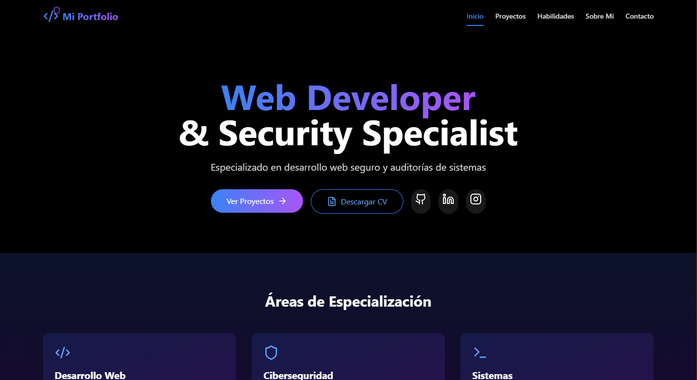
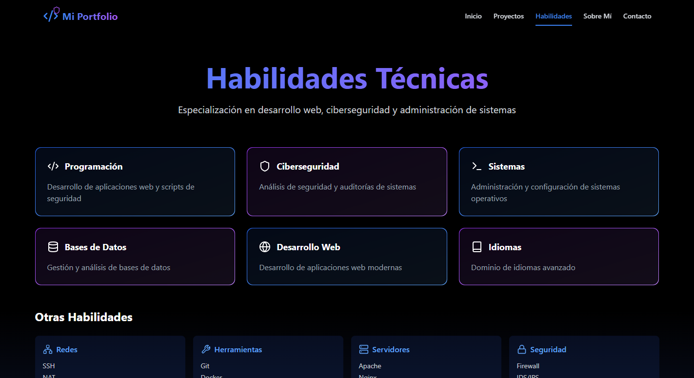

# My Portfolio

Welcome to the repository for my personal portfolio! This project showcases my skills, projects, and professional journey as a developer. The portfolio is designed to be fast, responsive, and user-friendly, providing an engaging experience for visitors.

## Live Preview
You can view the live version of my portfolio at:

**[nilfred.dev](https://nilfred.dev)**

---

## Features

- Built with **React** and **Vite** for fast builds and development.
- Styled using **Tailwind CSS** for a clean and modern design.
- Fully responsive design, optimized for mobile and desktop users.
- Includes sections for:
  - About Me
  - Skills
  - Projects
  - Contact Information

---

## Installation and Setup

If you want to run the portfolio locally, follow these steps:

1. Clone this repository:
   ```bash
   git clone https://github.com/nilfredb/my-portfolio.git
   ```

2. Navigate to the project directory:
   ```bash
   cd my-portfolio
   ```

3. Install dependencies:
   ```bash
   npm install
   ```

4. Start the development server:
   ```bash
   npm run dev
   ```

5. Open your browser and navigate to `http://localhost:5173`.

---

## Project Structure

```
my-portfolio/
├── public/          # Static assets
├── src/             # Source code
│   ├── components/  # Reusable React components
│   ├── pages/       # Pages of the application
│   ├── styles/      # Custom styles
├── dist/            # Production build
├── package.json     # Project dependencies and scripts
├── tailwind.config.js # Tailwind CSS configuration
└── vite.config.js   # Vite configuration
```

---

## Screenshots

### Home Page


### Skills Section


---

## Technologies Used

- **React**
- **Vite**
- **Tailwind CSS**
- **JavaScript (ES6+)**
- **HTML5 & CSS3**

---

## Contributing

Contributions are welcome! If you want to suggest improvements or report bugs, feel free to open an issue or submit a pull request.

---

## License

This project is licensed under the MIT License. See the [LICENSE](LICENSE) file for details.

---

## Contact

If you have any questions or want to connect, feel free to reach out:

- **Email:** [your-email@example.com](mailto:nbaez414@gmail.com)
- **Website:** [nilfred.dev](https://nilfred.dev)
- **GitHub:** [github.com/nilfredb](https://github.com/nilfredb)

